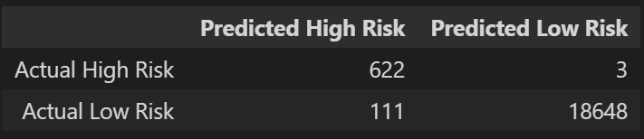
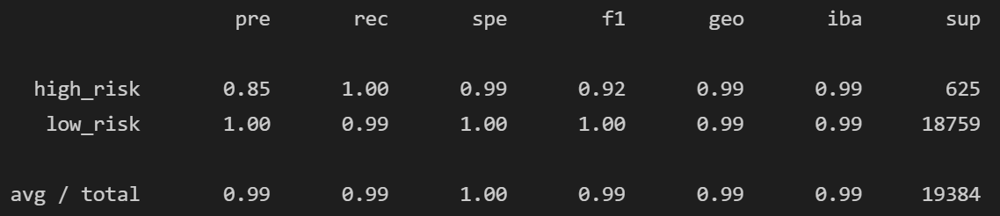
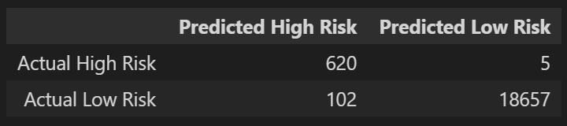
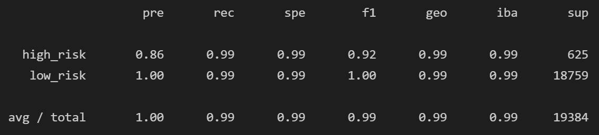
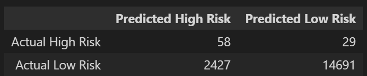
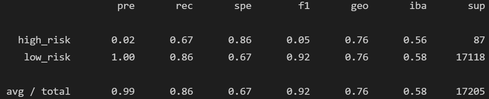
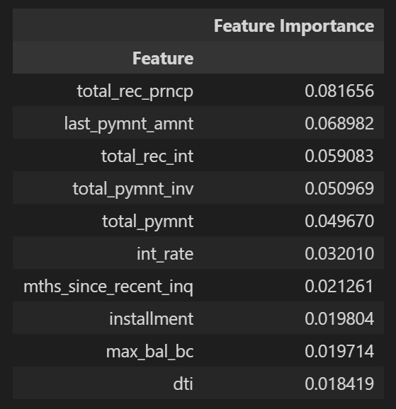

# Risky Business

In this assignment, I'll build and evaluate several machine learning models to predict credit risk using data you'd typically see from peer-to-peer lending services. I will use the imbalanced-learn and Scikit-learn libraries to build and evaluate models using the two following techniques:

1. [Resampling](#Resampling)
2. [Ensemble Learning](#Ensemble-Learning)

## Notebook Files

[Resampling Completed Notebook](credit_risk_resampling.ipynb)

[Ensemble Completed Notebook](credit_risk_ensemble.ipynb)

## Resampling 

### Oversampling with the Naive Random Oversampler and SMOTE algorithms

* Balance Accuracy Scores:
    * Naive Random Oversampler: 0.9946414201183431
    * SMOTE: 0.9946414201183431

* Confusion Matrix:
    * Both models obtained exactly the same confusion matrix.
    
    

* Imbalanced Classification Reports:

### Undersample with the Cluster Centroids algorithm

* Balance Accuracy Score: 0.9932813049736127

* Confusion Matrix:

* Imbalanced Classification Report:

### Oversample and undersample with the SMOTEENN algorithim

* Balance Accuracy Scores: 0.9946414201183431

* Confusion Matrix:

* Imbalanced Classification Reports:

### Classification Analysis - Resampling

1. Which model had the best balanced accuracy score?

   * The Naive Random Over Sampler, SMOTE and SMOTEEN all obtained the same score: 0.994
   * The Cluster Centroids came very close: 0.993

2. Which model had the best recall score?

    * All models had an average recall score of 0.99

3. Which model had the best geometric mean score?

    * All models had an average geometric score of 0.99

## Ensemble Learning

### Balanced Random Forest

* Balanced Accuracy Score : 0.7624430424114966

* Confusion Matrix:

* Imbalanced Classification Report

* Feature Importance - Top 10

### Classification Analysis - Ensemble Learning

1. Which model had the best balanced accuracy score?

    * The Easy Ensemble Classifier: 0.925

2. Which model had the best recall score?

    * The Easy Ensemble Classifier: 0.94 vs. 0.76

3. Which model had the best geometric mean score?

    * The Easy Ensemble Classifier: 0.93 vs. 0.76

4. What are the top three features?

    *  total_rec_prncp	0.081656  
    * last_pymnt_amnt	0.068982  
    * total_rec_int	0.059083
