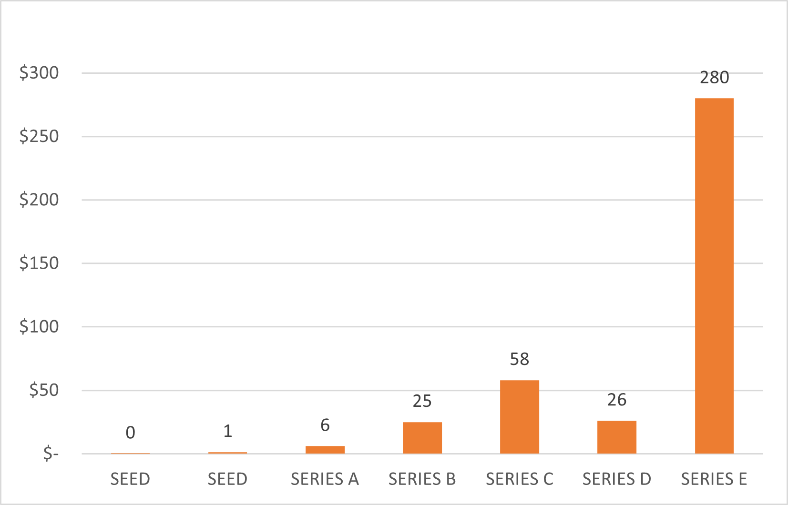
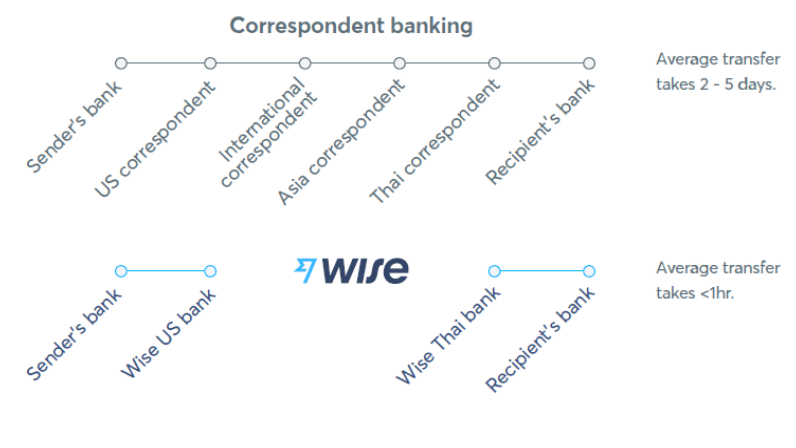
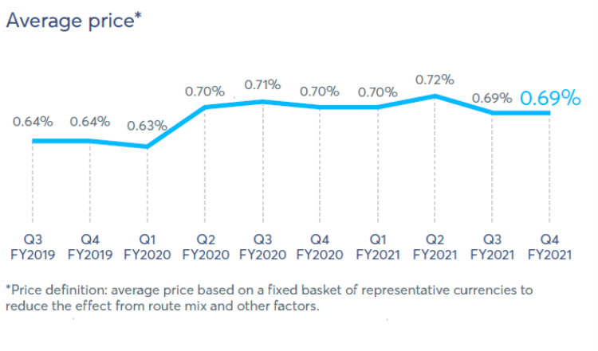

# Wise: Cheap, Quick & Transparent

## When foreign exchange fees were chiseling down on their income, two immigrants responded with a non-bank business solution that is now a *Forbes Top 50 FinTech* worth $11 billions  

 

Wise started as an appealing alternative for international money transfers by offering lower exchange rates than banks. It has since expanded to offer other services such as a multi-currency account, a debit card, and a business account.

---

## Overview and Origin

### When Inconvenience Fuels Creativity

It all began in 2011 with Taavet Hinrikus and Kristo Käärmann, two friends, who were consistently trying to reconcile British pounds (£) and euros (€). The two, originally from Estonia, resided in London. Taavet, got paid in euros, and required pounds to be able to transact in the UK. By contrast, Kristo received a salary in pounds, but required euros to pay back his mortgage in Estonia.

It wasn’t long before the two grew tired of the hefty fees and absurd exchange rates imposed by the banks for handling the two currencies, and so they started handling it themselves. Each month, Taveet transferred euros to Kristo’s account in Estonia, and Kristo deposited pounds into Taveet’s UK account. In doing so, they successfully eliminated the extra charges from their banks, and used the actual exchange rate posted on Reuters to transfer money to eachothers’ accounts. [^WW]

From this exercise, the idea of Wise, formerly TransferWise, was born. A platform capable of disrupting the long-standing dominance of banks and money transfer giants such as Money Gram and Western Union by guaranteeing a **minimal, upfront fee for international transactions.**

In order to do this, Wise based their business model on a “mid-market” exchange rate, i.e., exactly halfway between a currency's bid and ask rates [^EXrate]. This model is different from that of traditional banking where the exchange rate is set forth by the bank, and additional “hidden fees” may apply. As an example, this is an excerpt from Bank of America’s website,

> “Our foreign exchange rates might be different than other rates you see because our rates reflect all-in pricing that may include profit, fees, costs, charges or other markups (fee or markup levels may differ for each customer and may differ for the same customer depending on the method or venue used for transaction execution).” [^BoA]

Transparency has been one of Wise’s key selling points from day one. With their online fee calculator, customers can get full disclosure of fees upfront.  This typically consists of a **flat fee + fixed percentage of the transfer amount.** The customer is encouraged to compare these fees to other providers, and choose the one “that leaves you [the customer] with the most money.”[^WW]

At present, Wise serves over 10 million people sending money to 80 different countries, and bypasses over £3 million in bank fees every day. The Company has also expanded their services beyond money wiring. Customers can now have a multi-currency account supporting 54 currencies, a traveling debit card with Google Pay and Apple Pay functionality, and the option for business accounts.

On a courageous move by Taavet and Kristo, Wise became the first tech company to go public by **direct listing** on the London exchange (LSE) on July 7th, 2021. Indeed, the founders decided not to follow the formal initial public offering (IPO) process. Tipically, companies raise new capital a few days before their IPO by having investors submit bids for the pricing and number of shares they'd like to acquire. Instead, share price was determined through open auction. After their debut on the LSE, Wise's market capitalization was valued at $11 Billion. [^WIPO] [^FIPO] [^REU]

### Funding: Making Wise a Reality

Back in its conception, Kristo and Taavet self-funded for a year before landing any investors. Their first seed investment amounted to $1.3 million granted by 8 participating investors. This round was led by the capital venture firms, IA Ventures (backer for Better.com) and Index Ventures (investors for Dropbox and Slack) [^CB2] [^CB3] [^CB4]. It also saw the participation of individual investors, most notably PayPal co-founder, Max Levchin. Also worth highlighting, Wise was one of the winners for the 2011 SeedCamp week, a four day event in Europe that connects entrepreneurs, developers, experts and investors with tech start-ups. As one of the winners, they managed to secure funding from SeedCamp. [^FIPO] [^TC] [^Wiki] [^SC]

Although it took the founders some time to build up excitement by large investors, the company saw continuous upward support after the seed round. Here’s an illustration of Wise’s funding rounds in millions of dollars before their public offering on the LSE.

Data retrieved from [Craft.co](https://craft.co/transferwise/funding-rounds), [Crunchbase](https://www.crunchbase.com/organization/transferwise/company_financials), and [Dealroom.co](https://app.dealroom.co/companies/transferwise).

Financial support didn’t stop there, however, after their IPO, Wise received secondary market investments and debt financing. Overall, Wise has been backed by more than two dozen investors and received a total of $1.3 billions over the course of 13 investment rounds, with the latest occurring on May of 2021. [^CB]

## Business Activities

Wise aims to create a seamless experience moving money across borders. They believe it should be instantaneous, convenient and transparent to do so. The company started with two immigrants, and it should not come as a surprise that expats are a representative group of their customer base, but so are frequent travelers, online shoppers, property owners, freelancers and businesses of all sizes. Indeed, Wise provides a solution for sending or spending money abroad, holding various currencies, and creating a business platform for making or receiving international payments. They stand to disrupt the traditional banking experience of managing money internationally. In their own words,

> “Old-fashioned bank accounts only work properly in one country and one currency. The financial plumbing that connects them internationally is rusted” [^WW]

> “To fulfill our mission we have to overcome long standing obstacles. Chief among them: banking infrastructure. It’s clunky and entirely domestic.” - Kristo Käärmann [^REP21]

**Money should travel as quickly as email does.** This is the proposition that Wise makes. For instant transfers to be as regular as instant messaging has become, with more open and flexible transfer routes, or *pipes*, that will support the growth of people and businesses.

Fast and convenient multi-currency accounts capable of moving funds across borders will continue to gain popularity in the next couple of years. Let’s explore the state of the market at present to understand why.

### Digital Remmittance Market

In 2020, digital remittances represented a 16.3 billion USD industry, and that number is expected to grow to 17.7 billion USD by 2021. Moreover, the outlook for years 2021 through 2028 suggests a compound annual growth rate (CAGR) of 13%. These values can be found in the [Market Analysis Report]( https://www.grandviewresearch.com/industry-analysis/digital-remittance-market) published in 2021 by Grand View Research (GVR), a market research and consulting firm that paints a picture of global and regional business environments. Markedly, their database is used by renowned academic institutions and Fortune 500 companies.

Ultimately, the increase in market size can be attributed to the concurrent growth of,

- Payment automation and digitalization
- Digital-savvy customers with higher expectations for transaction times
- Urbanization and migration

Let's take a look at a few more numbers taken from the [Market Analysis Report]( https://www.grandviewresearch.com/industry-analysis/digital-remittance-market) to understand the growing sectors for this market in the upcoming years. But first, a few definitions from the report are necessary. Consider the following segments to explore the trends of the digital remittance market,

- Type: Outward (sending) or Inward (receiving) remittances
- Channel: Banks, Money Transfer Operators, Online Platforms, and Others (method used to execute the transaction)
- End-use: Personal, Business, Migrant Workforce, and Others (purpose of remittance)
- Region: North America, Europe, Asia Pacific, Latin America, Middle East & Africa

These definitions allow us to dissect a few key trends found in the 16.3 billion USD market of digital remittances, and the expectations for years 2021 through 2028, per GVR.

|Segment| Attribute | Details |Value|
| --- | --- | --- |---|
|Type| Outward digital remittance | dominated the market with 59% of global revenue in 2020 |~ $9.6 B|
|Type| Inward digital remittance | expected highest CAGR in forecast period | |
|Channel| Money transfer operators | dominated the market with 40% of global revenue in 2020|~ $6.5 B |
|Channel| Online Platforms| expected highest CAGR in forecast period | |
|Region| North America market share| dominated the market with 29% of global revenue in 2020|~ $4.7 B|

Due to the size increase of the market, businesses in this sector are being faced with the **opportunity** and **challenge** of growth to better support the needs of their customers. Special attention is being paid to,

- Supporting transactions in various languages, countries, and currencies
- Managing numerous types of transfers, such as prepaid cards and cash collection
- Offering multiple transfer options, such as mobile payment transfers and online payment transfers
- Offering integrated services with Enterprise Resource Planning (ERP), accounting, and foreign exchange software

This requires strategic planning focused on product innovation, partnerships, R&D initiatives, mergers and acquisitions, strategic joint ventures, and geographical expansion [^GVR].

### Business Solutions

Let’s dive deeper into the products that Wise offers and how these differ from those of their competitors. These core business solutions are Wise Transfer, Wise Account, Wise Business and Wise Platform.

#### **Wise Transfer**

Wise Transfer is the service that kicked off the company back in 2011. The main idea behind it is a “local payments system” that eliminates high fees - typical of the banking system – associated with handling international money wires and currency exchanges.

So why do banks charge so much for these transactions? During international wires, money tends to travel through multiple banks before reaching the intended recipient. The principle resembles that of air travel where direct flights are not always possible, and a longer route must be taken. Besides the reduced speed, this method also has an impact on the cost and traceability of the transaction since multiple institutions must be involved [^WB2]. Additionally, when banks exchange currencies, the exchange rate is set above the market to generate a profit as high as 4-6% of the transaction [^WB3].

Wise operates differently in that intermediaries are eliminated, and exchange fees avoided by collecting the money through a local bank in the home currency and country, and executing the pay out through a local bank in the recipient’s currency and country [^REP21]. This process is refered to as a peer-to-peer currency exchange, and can be visualized in the image below.

Image retrieved from "TransferWise Ltd Annual Report and Accounts 2021."

Let us explore in more detail some of the main criticisms of the traditional banking international transactions.

##### *SPEED*

Banks utilize the SWIFT network to make international transactions. The money doesn’t actually move, but instead, a payment order (SWIFT code) is utilized. These payment orders undergo several checks to comply with regulations for anti-fraud and anti-money laundering, and the time it takes to perform these depends on each bank’s internal processes and policies. Some other factors like intended currency, destination country, errors in recipient details, different time zones, holidays, and weekends can also drag the process out. On average, this process takes about 2-5 business days if no issues arise [^WB] [^WB2] [^REP21].

By contrast, with Wise Transfer, intermediaries are cut out, and international wire scrutiny can be avoided through an established network of central banks, local banks, and other local financial institutions that have partnered with Wise. Because of this, funds are always handled through local accounts that have a faster turnaround [^REP21].

So how much faster is Wise? Per their annual report for FY2021, 38% of transfers were instantaneous, 62% were received within an hour, and 83% happened in less than 24 hours [^REP21].

Competitors' timeframes are as follows,
- Skrill: same day for debit and credit transactions, and 2-5 days if using a bank transfer.
- Paypal: subject to bank (1-5 days).

##### *PRICE*

Although the cost for remittances worldwide has decreased in the last decade, it still remains quite high. The World Bank estimates the global average cost of remittance to be 6.38% of the transfer value in Q1 of 2021. This is a 2% decrease from Q4 in 2020, and a 34% drop since Q1 of 2009 [^RPW]. This data is not limited to online service providers, but comprehends banks, money transfer operators (MTOs), mobile operators, and post offices. Significantly, banks were the highest service provider averaging at a cost of 10.7% for completing the transaction [^RPW]. Some of the more common fees associated with international transactions are,

- Outgoing international transfer fee
- Flat fees taken by anywhere from 0 to 3 intermediary banks
- Currency exchange rate markup
- Incoming international transfer fee on the recipient side [^WB4]

In comparison to Skrill, Wise has the upper hand when handling different currencies, and making domestic transactions. One of the advantages of Skrill is that it has the option of sending money internationally without a fee associated with the transaction, as long as a debit card, ACH or bank transfer through Sofort/Klarna is used. This, however, is limited to 40 countries, and the recipient may incur fees from their financial institution for withdrawing the funds. There are also a mark-up fee of up to 5% to the exchange rate if a different currency is required. As for domestic transactions, a fee of up to 2% will be included [^BW] [^WB5] [^SK].

In the case of PayPal, the following fees are relevant for international transactions,
- 4% currency exchange fee subject to change
- 5% fee for using PayPal balance or bank account [^PP]

With Wise, local bank details instead of international banking information are used to transact. This allows customers to skip high exchange rates and inter-banking fees. This has resulted in more than £1 billion in savings during FY2021, and an average price for the transaction of just 0.69% [^WB3] [^REP21]. This is in stark contrast to the almost 11% average from banks worldwide.

Additionally, Wise claims to be at least 6 times cheaper than PayPal, and handling a volume of 2.5% of the remittances around the world [^REP21].

##### *TRANSPARENCY*

One of the biggest criticisms from Wise towards banks and companies like PayPal is the difficulty or reluctance to disclose the fees associated with international and multi-currency transactions. Typically, two fees apply, a fixed fee and an exchange rate mark-up. However, the mark-up is usually not disclosed up front, and can change overnight depending on the institution in order to accommodate a larger profit  [^WB6]. 

Wise’s fee calculator tool allows the costumer to determine the cost for wiring money without having to initiate a transaction. The tool displays the mid-market exchange rate and the fee charged by Wise. For FY2021, their estimates were over 90% accurate [^REP21].

Over the course of time, the fee charged by Wise may vary depending on their internal processes, but they pride themselves on lowering these fees whenever possible. Refer to the illustration below which depicts the evolution of the average fee for transaction.

#### **Wise Account**

The Wise account consists of a multicurrency account that can be paired with a debit travel card. Here’s a summary of its current stats:

- Regulated by FINCEN
- Apple Pay and Google Pay capabilities
- Visa and Mastercard travel cards available
- 10 million users of travel debit card
- Available in 30+ countries
- Manages balances of up to 10 currencies in one account
- Receive deposits in 50+ currencies
- 9$ total cost
- Up to 3 weeks for delivery of card
[^WW] [^REP21]

It should be noted that the Wise account is not equivalent to a bank account. Some of the main differences are, that unlike bank accounts, the money is safeguarded and not covered by the Financial Services Compensation Scheme (FSCS), there are no overdrafts or loans, and the balance does not gain interest [^WW]. The card is also different from prepaid travel cards which are popular amongst competitors. Some of the key distinctions are, initial load fees, reload fees, ATM fees and inactivity fees are all fair game. By contrast, Wise does not charge a fee for adding money to the debit card.

Some other multi-currency account options in the market are from,

##### *PAYONEER*

- Currency conversion rate at -0.5% of transaction. This is lower than the average for Wise.
- Includes annual account fee
- Includes account withdrawal fees

##### *PAYPAL*

- Includes withdrawal fees and limits

##### *MONESE*

- Several prepaid card options
- Exchange rate applied before trip
- Hold balance in pounds or euros only
- Receive 18+ currencies
- Available in 20 countries
- More bank account features, such as financial analysis, budgeting, direct debits
[^MO]

#### **Wise Business**

Wise Business builds up on Wise Transfer and Wise Account. The main difference is that it’s tailored to freelancers, entrepreneurs, small businesses operating over different countries and currencies. For a small fee, Wise manages their money “locally”. Some of the capabilities of the business account are invoicing; payment automation and accounting integration; team accounts; multiple Wise Business debit cards; batch payments; recurring (scheduled) payments; and Application Programming Interface-based (“API”) payment workflow automation. By March of 2021, Wise Businesses consisted of over 300,000 active customers [^REP21].

Competitors in this area:

- OFX
- Payoneer

#### **Wise Platform**

Wise Platform provides an opportunity for strategic partnerships with banks, credit unions and financial institutions to integrate Wise’s payments network for mobile applications and online banking. Platform clients can integrate through the open API from Wise. The Platform also features 24/7 support. Moreover, distribution partners, such as core banking software and technology services providers, are able to level up their own products by pre-integrating Wise [^REP21]. As of 2021, Wise has successfully integrated with,

- 14 banks across four continents,
- Monzo and N26, leading neobanks
- Standford Federal Credit Union,
- Xero
- Emburse
- Google Pay

… and many others

---

## Landscape

Over the past couple of decades, the payments sector has had to continuously evolve as technological improvements are always on the horizon. Some of the most prominent changes were the introduction of the first few credit cards back in the 50’s, the appearance of ATM machines in the 60’s, and the development of the SWIFT network back in the 70’s [^OANNA]. 

However, in recent years, FinTech companies have spearheaded the disruption of traditional models. These non-bank solutions have changed the way we think about transactions in a way that prioritizes convenience and instantaneity. Markedly, the mobile platform industry and non-payment value-added services now fall under the scope of the Payments sector [^OANNA]. 

Indeed, long-standing financial institutions are rapidly trying to adapt to meet the demand for these integrated services. The most striking of these being streamlining payments or integrating billing, mobile payments, security developments, cryptocurrencies and peer-to-peer transfers [^OANNA]. To accurately capture the essence of the industry’s sentiment,

> *“Fintech start-ups are nimble piranhas, each focusing on a small part of a bank’s business model to attack”* – [Financial Times]( https://www.ft.com/content/55049480-61cb-11e5-9846-de406ccb37f2), 2015.

Let’s review some numbers from McKinsey & Co. concerning the demand for innovation in the Payments domain that justify undergoing technological changes.

|Parameter|Year|Metric|
|---|--- |---|
|Executed a mobile payment|2019 |77% of US consumers|
|% of population using mobile payments, per generation|2019 | Millenials 91%, Gen X 80%, Baby Boomers 64%|
|Use of two or more digital payment methods|2020|58% of US consumers (13% jump since last year)|

[^MK1] [^MK2]

Moreover, technological advances have not been the only disruptive force in the Payments sector, but also new expectations from the customer base, and a changing regulatory framework. For the first of these, some of the service feature expectations are:

- Efficient and real-time
- Integrated and flexible (single platform)
- Accessible and user-friendly
- Tailored and personalized (customized profile experiences)
- Intuitive (AI) [^OANNA]

The above is not meant to be a comprehensive list, but a panorama of the present challenges for financial instutions.

As for the regulatory framework, the intent is to encourage competition and innovation amongst service providers while also reducing risk, standardizing processes, and increasing transparency. A good example of this is the creation of the Single European Payment Area (SEPA) which provides standards for payment processing across the EU [^OANNA].

Now that we have discussed what drives change in the Payments sector, here’s a brief overview of the major innovations for this sector,

- Going mobile: proves a convenient and relatively cheap way to access the internet.
- Near-Field-Communication technology (NFC): the key behind contactless payments. Has been implemented for in-store payments, e.g. Starbucks.
- APIs: present the opportunity for banks and financial institutions to expand their business, add new services, and open new channels.
- Digital wallets: integrated tools. They enable mobile remote payments, proximity payments, and value-added services such as ticketing, ID storage, etc.

If we haven’t already, it’s time to realize that Payments is undergoing a rebuild. Estimates suggest that by 2030, the domain will be witness to **2.7 trillion transactions moving from cash to cards and e-payments** [^ACC].

Here’s a short list of some of the most prominent players in the Payments domain:

* Paypal
* Western Union
* Money Gram
* Venmo
* Square
* BrainTree
* Plaid
* Stripe
* Stellar
* Marqeta
* Remitly
* Ripple
* Circle

---

## Results

### Wise Financials at a Glance

|Metric|Value|Fiscal Year|
|---|---|---|
|Cash and Cash equivalents|£2.1 billion|FY2020|
|Cash and Cash equivalents| £3.4 billion|FY2021
|Revenue|£303 million| FY2020|
|Revenue|£421 million| FY2021|
|Revenue growth|39%|FY2021
|Profit before tax|£20 million|FY2020|
|Profit before tax|£41 million|FY2021|
|Net profit| £30.9 million|FY2021|
|Net profit| £15 million *restated|FY2020|

### WISE.L stock data

- Stock price: £10
- Market capitalization: £10.1 Billions

### Company shares

- Shares issued in 2021: 563,587 ordinary shares for a total of £0.9 million.
*As of September 7th, 2021.

### Performance Against Competitors

|Parameter| Formula |Wise| Remitly |Stripe| MoneyGram| Western Union |
|---|---|---|---|---|---|---|
|Revenue| - |$583M, 2021 & $530M, 2020|$80M, 2018|$2.5B, 2020|$1.2B, 2020|$4.6B, 2020|
|Market capitalization| - |$14B|$1.5B|$95B|$811M|$8.8B|
|Gross profit margin| (Revenue - Cost of Sales) / Revenue * 100|64%, 2021 & 61%, 2020| ? | ? |8.4%, 2020| 39%, 2020|
|Current ratio| Current Assets / Current Liabilities|1.07| ? | ? |0.95|1.02|
|Leverage| Total Assets / Total Equity|15.1| ? | ? | ? |50|
|Debt to Equity Ratio| Total Debt / Total Equity |0.36| ? | ? | ? |16.6|

Note the following observations from the performance of Wise vs. Competitors,

- Revenue: Stripe, MoneyGram and Western Union showcase large revenue numbers as compared to Wise
- Market capitalization: Stripe is the highest valued company amongst the competitors, (not closely) followed by Wise and Western Union
- Profitability: Wise showed the highest profitability against MoneyGram and Western Union
- Liquidity: Wise and Western Union have a current ratio >1, this means both companies are short-term solvent (good liquidity)
- Leverage: Western Union has a higher amount of assets financed by debt than Wise does 
- Debt to Equity: Wise is a more attractive company than Western Union for banks and lenders to extend new debt to. This is because of the ratio below 1.

Additionally,

- The year-end financial reports from Wise for FY 2021, end on march 31st, 2021. The other company reports do not operate by fiscal year.
- Detailed financial statements from MoneyGram and Western Union for 2021 were not possible to obtain
- Detailed financial statements from Stripe and Remitly were not possible to obtain
- Equity data for MoneyGram was not possible to obtain

Data for this section retried from: [^REP21] [^CR2] [^MFS]

---

## Recommendations

### Expansion of Wise Business

One of the key areas for potential growth is Wise Business. 
Wise Business currently has a 300K businesses customer base which only represents 3% of their total customer base. Furthermore, outside of Europe, North America and Asia-Pacific, this service only generates around 6% of the total revenue, or £18.2 M [^FB] [^FB2] [^REP21]. 
[Forbes](https://www.forbes.com/sites/danielwebber/2021/07/26/after-the-direct-listing-wises-biggest-challenges-to-come/?sh=640641694f7f) suggests the company should focus their expansion to Africa and Latin America.
The main challenge to be faced in these regions is growing competition.  In the case of Africa, the remittance market is geared towards cash and mobile wallets, which Wise does not specialize in. As for Latin America, local Fintechs are spreading left and right in the latest years. Approaching these new business regions will require Wise to have a target strategy and even additional product solutions [^FB].

### Underbanked Population

As a personal consideration, I believe Wise should extend their services to the underbanked population. At present, Wise requires its customers to have a local bank account in their place of residence. This is the basis of their business model. However, there’s an estimated 1.7 billion underbanked individuals across the globe [^ST]. These people are the ones most affected by the elevated fees of traditional money transfer operators – they simply can’t afford it.

One of the other reasons for considering operations without the use of a bank account is to support money transfer in areas where natural disasters and conflicts are occurring. Individuals under these circumstances often find themselves relying on “informal networks” for money transfers.  Consider the following examples,

|| Crisis-affected | Restricted | Post-Conflict|
|---|---|---|---|
| Definition | Corridors impacted primarily by natural disasters and conflict (and in some cases financial crisis)| First case, a country has an established formal financial services sector but is subject to external sanctions. Second case, severe legal and operational restrictions exist, preventing certain forms of financial service provider, and restricting exchange controls | Formal financial systems are often absent, weak, or distrusted (due to bankruptcies or other factors) in countries or regions recovering from conflict. The timeframe for recovery is long, and often the situations are extremely complex. Parts of the country may still be subject to conflict that |
| Examples | Haiti earthquake in 2010, where the banking system literally collapsed causing huge problems in providing cash in the country and the reconstruction of the banks.| 1) Syria, North Korea, Myanmar 2) India, Pakistan| Afghanistan, Mali, Somalia |

Data retrieved from: [^BW].

Informal networks act as ‘social brokers’ or ‘mediators’ between the local infrastructure and the intricate web of banking and trade partners, but can and typically do face restrictions from governing bodies, or acceptance from foreign countries [^BW]. The key challenge of informal networks for money transfers is security. Specifically, concerns regarding fraud and money-laundering. Because of this, compliance with regulations, guidelines and initiatives to minimize criminal and terrorist fund activity is of the utmost importance. This is where Fintechs can help.
In particular, a blockchain network like Stellar could provide the link between the underbanked and the broad reach that Wise, a trusted and regulated digital remittance provider, can offer.

Some of the benefits of Stellar are,

- The underbanked are its target audience
- Stellar has signed several key partnerships with payment providers. This could bring open up different markets and increase collaboration opportunities through open APIs. Some examples are,
    - Coins.ph: a mobile app that allows anyone with a Stellar wallet to send money to a mobile phone in the Philippines.
    - Flutterwave: mobile payment platform used by 21 million people across Africa.
    - ICICI Bank 
    - IBM: 12 currency corridors for cross-border payments including Australia, New Zealand, the UK and several Pacific Islands. This is facilitated by the relationships that IBM holds with banks across the globe.

Wise may consider a partnership with a blockchain network of this type, even if not with Stellar. The reason for this is that Stella has already initiated negotiations to purchase MoneyGram, one of Wise’s competitors [^YH].

### Other

A few final considerations for Wise are,

- Increase speed, only 38% are instantaneous
- Support more countries
- Broaden currency support, including cryptocurrencies
- Address customer criticisms, in particular, Wise’s right to terminate an account without notice, and taking 90 days to return funds [^Wiki].

---

## Sources

[^WW]: https://wise.com/

[^EXrate]: https://www.investopedia.com/terms/m/middle-rate.asp

[^BoA]: https://www.bankofamerica.com/foreign-exchange/foreign-exchange-rates-faq/

[^WIPO]: https://fortune.com/2021/07/07/fintech-wise-public-london-stock-exchange-direct-listing/

[^FIPO]: https://www.forbes.com/sites/daviddawkins/2021/07/07/wise-founders-krmann-and-hinrikus-become-first-estonian-tech-billionaires-after-london-ipo/?sh=5306b4a15ecb

[^REU]: https://www.reuters.com/business/wise-shares-indicated-open-10-bln-valuation-auction-2021-07-07/

[^CB]: https://www.crunchbase.com/organization/transferwise/company_financials

[^CB2]: https://www.crunchbase.com/funding_round/transferwise-seed--69dfec5c

[^CR]: https://craft.co/transferwise/funding-rounds

[^DR]: https://app.dealroom.co/companies/transferwise

[^TC]: https://techcrunch.com/2011/09/12/seedcamp-week-2011-meet-the-finalists-the-winners-and-one-good-samaritan/

[^Wiki]: https://en.wikipedia.org/wiki/Wise_(company)/

[^SC]: https://seedcamp.com/your-mentors/

[^CB3]: https://www.crunchbase.com/organization/index-ventures/investor_financials

[^CB4]: https://www.crunchbase.com/organization/ia-ventures/investor_financials

[^REP21]: TransferWise Ltd Annual Report and Accounts 2021. Print.

[^REP20]: Annual report and consolidated financial statements for the year ended 31 March 2020. Print.

[^GVR]: https://www.grandviewresearch.com/industry-analysis/digital-remittance-market

[^WB1]: https://wise.com/us/blog/international-wire-transfer-time

[^WB2]: https://wise.com/us/blog/everything-you-need-to-know-about-swift-network

[^WB3]: https://wise.com/gb/blog/what-are-bic-swift-codes-guide

[^WB4]: https://wise.com/gb/blog/transferwise-vs-bank-transfers

[^RPW]: Remittance Prices Worldwide - Issue 37, March 2021

[^BW]: https://www.businesswire.com/news/home/20200608005318/en/Skrill-Launches-Free-International-Money-Transfer-Service-In-U.S.

[^SK]: https://www.skrill.com/en/siteinformation/fees/#send-money-receive-money

[^PP]: https://www.paypal.com/en/webapps/mpp/paypal-fees

[^WB5]: https://wise.com/gb/blog/skrill-money-transfer

[^WB6]: https://wise.com/gb/blog/why-we-care-about-hidden-fees

[^MO]: https://www.monito.com/en/wiki/monese-vs-wise

[^MK1]: https://www.mckinsey.com/industries/financial-services/our-insights/banking-matters/are-convenience-and-rewards-leading-to-a-digital-flashpoint

[^MK2]: https://www.mckinsey.com/industries/financial-services/our-insights/banking-matters/us-digital-payments-achieving-the-next-phase-of-consumer-engagement

[^OANNA]: Omarini, Anna. “Fintech and the Future of the Payment Landscape: The Mobile Wallet Ecosystem A Challenge for Retail Banks?” 2018.

[^ACC]: https://www.accenture.com/us-en/insights/banking/payments-modernization-playing-long-game

[^CR2]: https://craft.co/transferwise/metrics

[^MFS]: MoneyGram International Reports Fourth Quarter and Full-Year 2020 Financial Results

[^FB]: https://www.forbes.com/sites/danielwebber/2021/07/26/after-the-direct-listing-wises-biggest-challenges-to-come/?sh=640641694f7f

[^FB2]: https://www.forbes.com/sites/daviddawkins/2021/07/07/wise-founders-krmann-and-hinrikus-become-first-estonian-tech-billionaires-after-london-ipo/?sh=4863f1dd5ecb

[^BW]: Case study: Somalia and UK banking. BeechWood International. 2013.

[^OV]: https://www.overtureglobal.io/story/bringing-blockchain-to-the-unbanked

[^ST]: https://resources.stellar.org/remittances-and-the-stellar-network?utm_term=global%20remittance&utm_campaign=Search:+Payments&utm_source=adwords&utm_medium=ppc&hsa_acc=8782384464&hsa_cam=12954684434&hsa_grp=116947555330&hsa_ad=518899957375&hsa_src=g&hsa_tgt=kwd-313340948833&hsa_kw=global%20remittance&hsa_mt=p&hsa_net=adwords&hsa_ver=3&gclid=Cj0KCQjw4eaJBhDMARIsANhrQABaBhkIyhhXHEB-SpSubjcDFpSsSEZxJ4X-53Wz2ptRujmcmLasMooaAqMQEALw_wcB

[^YH]: https://www.yahoo.com/now/stellar-makes-move-former-ripple-100903449.html