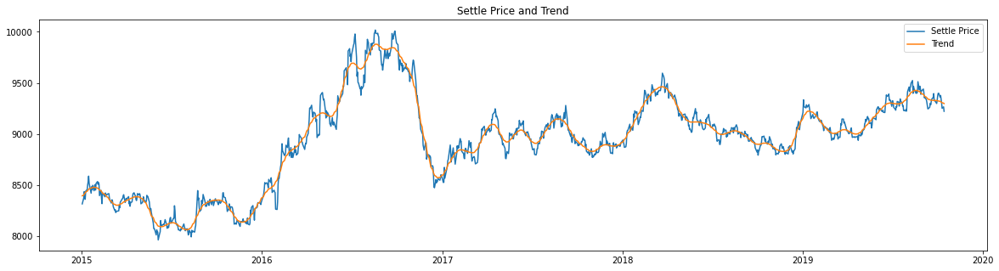
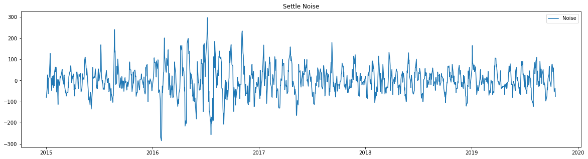
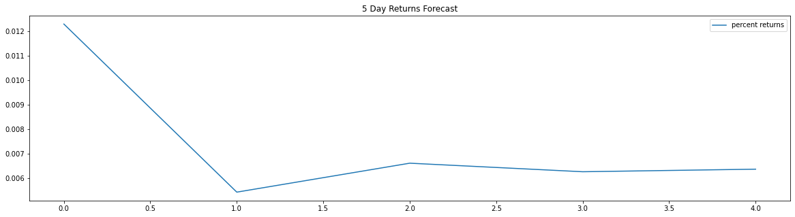
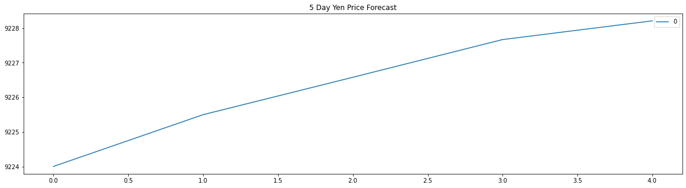
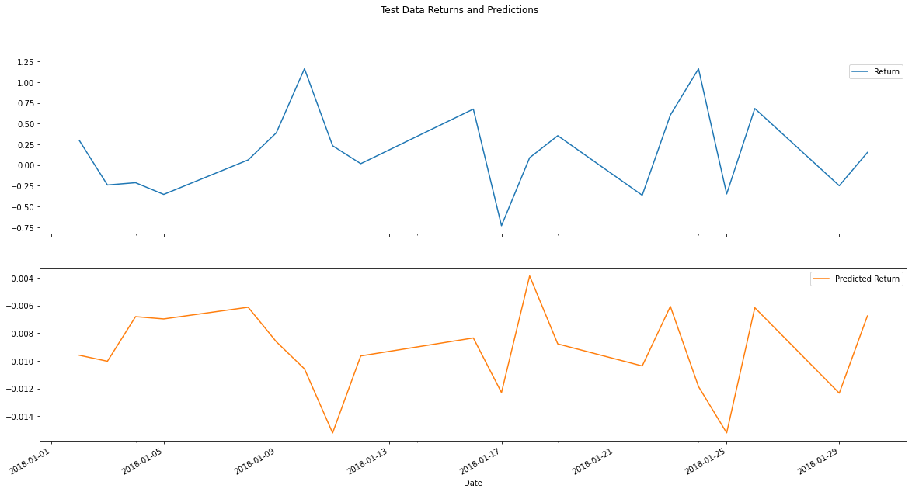
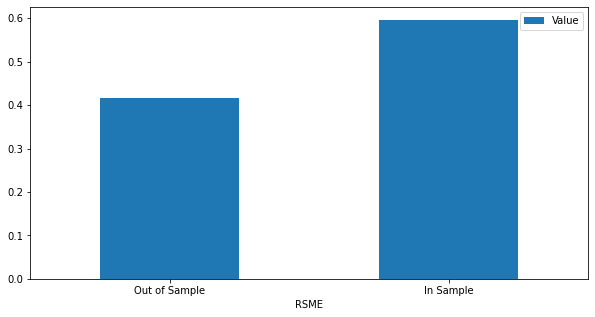

# A Yen for the Future

Let us examine the future movements in the value of the Japanese Yen versus the U.S. dollar using Time Series tools and historical data for the Yen price from 1990 to 2019.

## Time Series Analysis

1. Decomposition using a Hodrick-Prescott Filter.

2. Forecasting Returns using an ARMA Model.

3. Forecasting the Settle Price using an ARIMA Model.

4. Forecasting Volatility with GARCH.

### Discussion

The ARMA and ARIMA models contradict each other. The first expects the Yen price to drop while the second indicates a rise in value. Furthermore, for both the ARMA and ARIMA models, the p-values are much larger than 0.05. The AIC and BIC are also really large. This indicates the models fit the data poorly. Per the GARCH model, the volatility of the Yen is expected to increase. This suggest any investments on the currency will become more and more risky.  Based on this information, I would not rely on the models for making any financial decisions regarding the Yen.

## Linear Regression Analysis

1. Making predictions using the testing data.

2. Out-of-sample performance.

Out-of-Sample Root Mean Squared Error (RMSE): 0.41545437184712763

3. In-sample performance.

In-sample Root Mean Squared Error (RMSE): 0.5962037920929946

### Discussion

Based on the RMSEs, the model performs better for in-sample data (0.6) than out-of-sample data (0.42).

